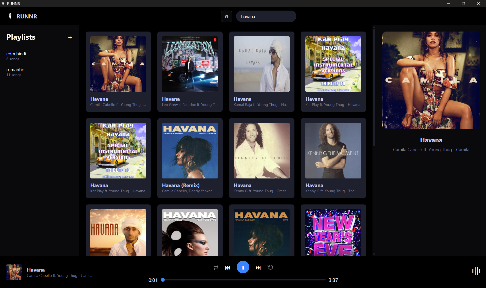
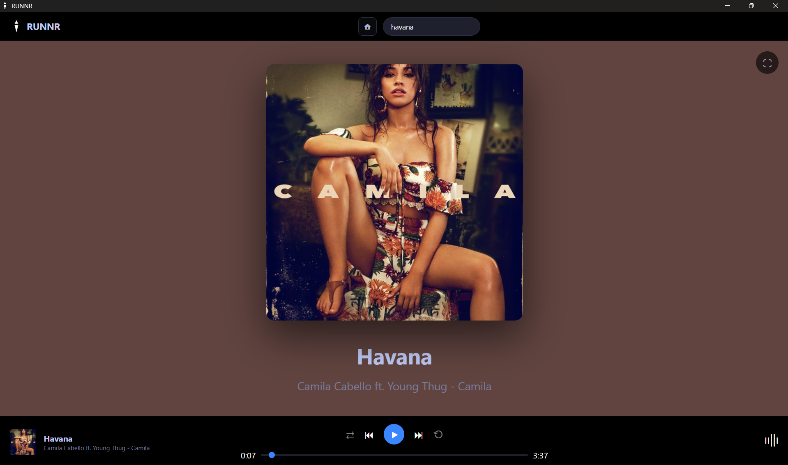

# RUNNR 

A modern, feature-rich desktop music streaming application built with Electron.js.

## Features

###  Core Functionality
- **Music Search**: Search and play thousands of songs.
- **Playlist Management**: Create, organize, and manage custom playlists
- **Now Playing Sidebar**: Beautiful sidebar displaying current track information
- **Full-Screen Mode**: Immersive full-screen view with dynamic background colors

### Playback Controls
- **Shuffle Mode**: Randomize your playlist order
- **Repeat Modes**: 
  - No Repeat (default)
  - Repeat Playlist
  - Repeat Single Song
- **Previous/Next Track Navigation**
- **Seek Bar**: Jump to any position in the track
- **Play/Pause Controls**

### User Interface
- **Dark Theme**: Modern dark UI with Tokyo Night color scheme
- **Responsive Design**: Adapts to different window sizes
- **Welcome Slides**: First-time user onboarding experience
- **Smooth Animations**: Polished transitions and hover effects

### Data Persistence
- **Local Storage**: Playlists saved locally in user data directory
- **Session Management**: Remembers your playlists across sessions

## Screenshots

### Main Interface
- Left sidebar with playlist management
- Center content area with search results
- Right sidebar showing currently playing track

### Full-Screen Mode
- Dynamic background based on album art colors
- Centered album artwork
- Large, readable song information

## Installation

### Prerequisites
- Node.js (v14 or higher)
- npm or yarn

### Setup

1. Clone the repository
